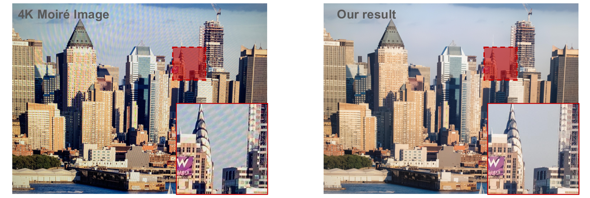
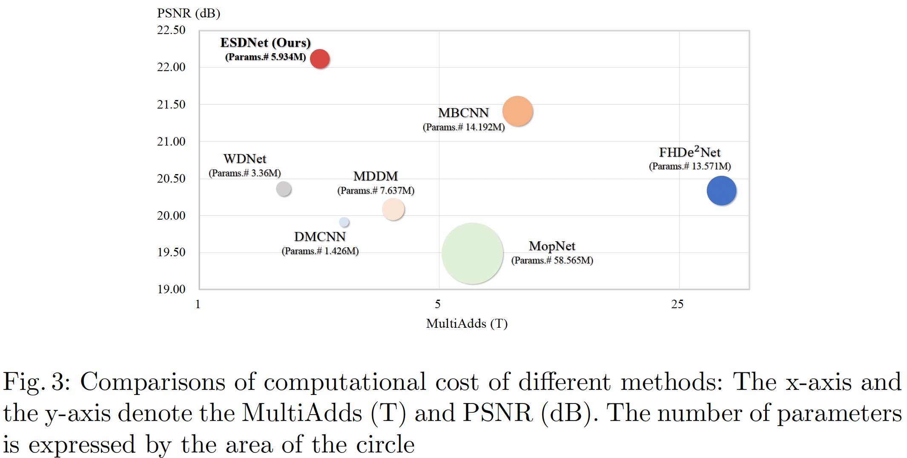
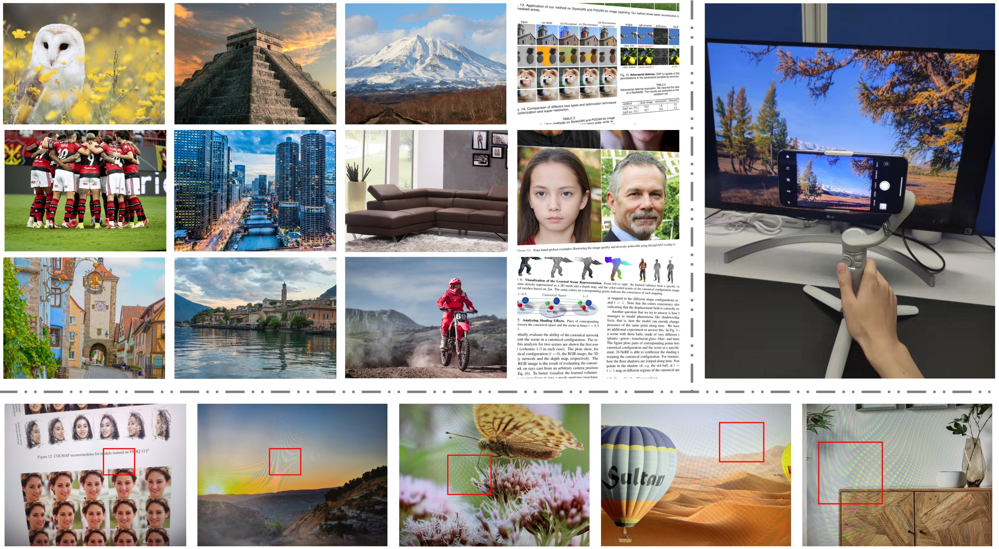
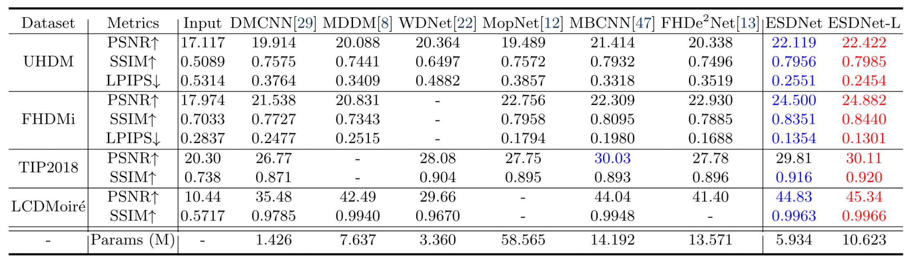

# Towards Efficient and Scale-Robust Ultra-High-Definition Image Demoiréing

### [Project Page](https://xinyu-andy.github.io/uhdm-page/) | [Dataset](https://drive.google.com/drive/folders/1DyA84UqM7zf3CeoEBNmTi_dJ649x2e7e?usp=sharing) | [Paper](https://arxiv.org/pdf/2207.09935)
[](https://paperswithcode.com/sota/image-restoration-on-uhdm?p=towards-efficient-and-scale-robust-ultra-high)
[](https://paperswithcode.com/sota/image-enhancement-on-tip-2018?p=towards-efficient-and-scale-robust-ultra-high)

**Towards Efficient and Scale-Robust Ultra-High-Definition Image Demoireing** (ECCV 2022)  
Xin Yu, Peng Dai, Wenbo Li, Lan Ma, Jiajun Shen, Jia Li, [Xiaojuan Qi](https://scholar.google.com/citations?user=bGn0uacAAAAJ&hl=en)




## :hourglass_flowing_sand: To Do
- [x] Release training code
- [x] Release testing code
- [x] Release dataset
- [x] Release pre-trained models
- [x] Release an improved model trained on combined datasets
- [x] Add an online demo :hugs:

## :rocket:  :rocket:  :rocket: **News**:
- **Jul. 31, 2022**: Add an online demo in [HuggingFace Space :hugs:](https://huggingface.co/spaces/ECCV2022/Screen_Image_Demoireing), which allows testing via an interactive window. Note the demo runs on CPU, so the inference may cost 80s per 4K image. The demo model was trained on combined datasets for more robust qualitative performance.


## Introduction
When photographing the contents displayed on the digital screen, an inevitable frequency aliasing between the camera’s 
color filter array (CFA) and the screen’s LCD subpixel widely exists. The captured images are thus mixed with colorful 
stripes, named moire patterns, which severely degrade images’ perceptual qualities. Although a plethora of dedicated 
demoiré methods have been proposed in the research community recently, yet is still far from achieving promising results 
in the real-world scenes. The key limitation of these methods is that they all only conduct research on low-resolution or 
synthetic images. However, with the rapid development of mobile devices, modern widely-used mobile phones typically allow 
users to capture 4K resolution (i.e.,ultra-high-definition) images, and thus the effectiveness of these methods on this
practical scenes is not promised. In this work, we explore moire pattern removal for ultra-high-definition images. 
First, we propose the first ultra-high-definition demoiréing dataset (UHDM), which contains 5,000 real-world 4K 
resolution image pair, and conduct a benchmark study on the current state of the art. Then, we analyze limitations 
of the state of the art and summarize the key issue of them, i.e., not scale-robust. To address their deficiencies, 
we deliver a plug-and-play semantic-aligned scale-aware module which helps us to build a frustratingly simple baseline 
model for tackling 4K moire images. Our framework is easy to implement and fast for inference, achieving state-of-the-art 
results on four demoiréing datasets while being much more lightweight. 
We hope our investigation could inspire more future research in this more practical setting in image demoiréing.


<p align="center"></p>


## Environments

First you have to make sure that you have installed all dependencies. To do so, you can create an anaconda environment called `esdnet` using

```
conda env create -f environment.yaml
conda activate esdnet
```

Our implementation has been tested on one NVIDIA 3090 GPU with cuda 11.2.

## Quick Test

Once you have installed all dependencies, you can try a quick test without downloading training dataset:

### 1. Download our pre-trained models:
We provide pre-trained models on four datasets, which can be downloaded through the following links:
| **Model Name** |  **Training Dataset** | **Download Link** |
| :---------: |  :---------: | :---------------: |
|    ESDNet  |   UHDM  | [uhdm_checkpoint.pth](https://drive.google.com/file/d/1HT_ubcAYRqzFIJ46XuPhrulJk2YFBIEl/view?usp=sharing) |
|    ESDNet-L  |   UHDM  | [uhdm_large_checkpoint.pth](https://drive.google.com/file/d/1PyCLCytsu4F8gEk_04a8Qs7pcsHazAie/view?usp=sharing) |
|    ESDNet  |   FHDMi  | [fhdmi_checkpoint.pth](https://drive.google.com/file/d/19GaA5F7aTUUrgZig4qlR8ISe23mPc8m_/view?usp=sharing) |
|    ESDNet-L |   FHDMi  | [fhdmi_large_checkpoint.pth](https://drive.google.com/file/d/1Fwx0b2jJHgx4cgqrd8d_4er2UGYbZO0s/view?usp=sharing) |
|    ESDNet |   TIP2018  | [tip_checkpoint.pth](https://drive.google.com/file/d/1CcYDakV9r6sZTsJvdkzC-uutAlOrexW8/view?usp=sharing) |
|    ESDNet-L  |   TIP2018  | [tip_large_checkpoint.pth](https://drive.google.com/file/d/1oqmpBM-3gDwEKRMKoS6cKT0-3_EzBPAf/view?usp=sharing) |
|    ESDNet |   LCDMoire  | [aim_checkpoint.pth](https://drive.google.com/file/d/1WWFz-BYpW9QAwGGSy7hVPSDNT0DARnhZ/view?usp=sharing) |
|    ESDNet-L |   LCDMoire  | [aim_large_checkpoint.pth](https://drive.google.com/file/d/114EDQnJ0AUEGiXFmA9Hiwj_m7sj1KyNW/view?usp=sharing) |

Or you can simply run the following command for automatic downloading:

```
bash scripts/download_model.sh
```

Then the checkpoints will be included in the folder `pretrain_model/`. 

### 2. Test with your own images:
Change the configuration file `./demo_config/demo.yaml` to fit your own setting, and then simply run:

```
python demo_test.py --config ./demo_config/demo.yaml
```

the output images will be included in the path depending on the flags `SAVE_PREFIX` and `EXP_NAME` in your configuration file. 

## Dataset

We provide the 4K dataset UHDM for you to evaluate a pretrained model or train a new model.
To this end, you can download them [here](https://drive.google.com/drive/folders/1DyA84UqM7zf3CeoEBNmTi_dJ649x2e7e?usp=sharing), 
or you can simply run the following command for automatic data downloading:
```
bash scripts/download_data.sh
```
Then the dataset will be available in the folder `uhdm_data/`.

## Train
To train a model from scratch, simply run:

```
python train.py --config CONFIG.yaml
```
where you replace `CONFIG.yaml` with the name of the configuration file you want to use.
We have included configuration files for each dataset under the folder `config/`.

For example, if you want to train our lightweight model ESDNet on UHDM dataset, run:
```
python train.py --config ./config/uhdm_config.yaml
```
   

## Test
To test a model, you can also simply run:

```
python test.py --config CONFIG.yaml
```

where you need to specify the value of `TEST_EPOCH` in the `CONFIG.yaml` to evaluate a model trained after specific epochs, 
or you can also specify the value of `LOAD_PATH` to directly load a pre-trained checkpoint.

## Results

### Quantitative Results:
<p align="center">  </p>

## Extended link:
If you want to remove moire patterns in your video, you can try our CVPR 2022 work: [VDMoire](https://github.com/CVMI-Lab/VideoDemoireing)


## Citation
Please consider :grimacing: staring this repository and citing the following papers if you feel this repository useful.

```
@inproceedings{yu2022towards,
  title={Towards efficient and scale-robust ultra-high-definition image demoir{\'e}ing},
  author={Yu, Xin and Dai, Peng and Li, Wenbo and Ma, Lan and Shen, Jiajun and Li, Jia and Qi, Xiaojuan},
  booktitle={European Conference on Computer Vision},
  pages={646--662},
  year={2022},
  organization={Springer}
}

@inproceedings{dai2022video,
  title={Video Demoireing with Relation-Based Temporal Consistency},
  author={Dai, Peng and Yu, Xin and Ma, Lan and Zhang, Baoheng and Li, Jia and Li, Wenbo and Shen, Jiajun and Qi, Xiaojuan},
  booktitle={Proceedings of the IEEE/CVF Conference on Computer Vision and Pattern Recognition},
  year={2022}
}
```

## Contact
If you have any questions, you can email me (yuxin27g@gmail.com).


